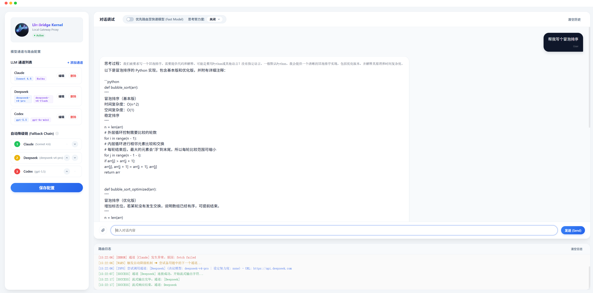
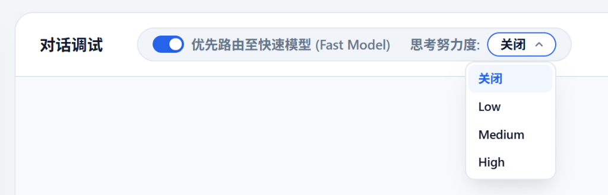
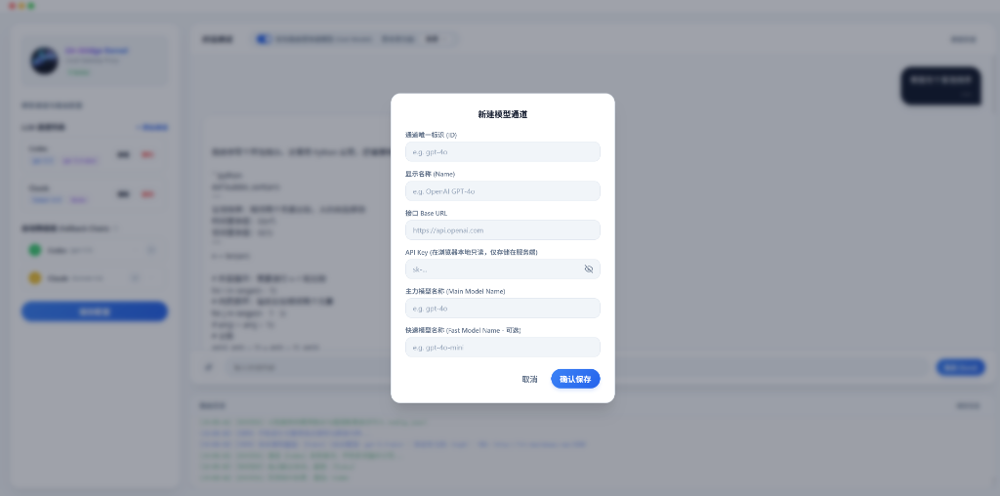

# LlmBridge Gateway

`LlmBridge` 是一个轻量级、零外部依赖的**大语言模型（LLM）流式调用与故障降级桥接网关**。它旨在为开发者提供一个拥有可视化调试面板的网关代理，支持多通道轮询、任务场景别名路由、流式断线自动降级（Fallback Chain）以及多模态图片大图等比压缩上传。



---

## 核心特性 (Key Features)

*   **极速流式转发 (Streaming Proxy)**：基于 Express 实现的超轻量转发，支持服务端事件流（SSE），完美兼容 OpenAI / Claude 兼容接口的实时打字机输出效果。
*   **动态故障降级 (Fallback Chain)**：一旦首选模型通道发生异常（如欠费、限流 429、网络超时或证书错误），网关会自动且无缝地顺延尝试备用通道，保障线上业务的绝对连续性。
*   **多模态图片自适应压缩**：前端集成 Canvas 算法，对上传的超大分辨率（如视网膜屏高分截图等）图片进行**智能等比限高压缩（默认上限 2048px）**，极大地降低传输体积和 Token 消耗。
*   **极简暗黑视窗面板 (Sleek UI Panel)**：
    *   **物理风格滑动开关**：控制 Fast Model 快速路由状态。
    *   **实时路由调试控制台**：无间断滚动输出网关底层的重试与降级决策日志。
    *   **自定义 Promise 确认弹窗**：告别浏览器原生的阻断弹窗，体验纯净现代。
*   **持久化配置**：所有的通道配置和路由规则通过面板配置后一键“保存配置”，在后端自动持久化写入本地 `config.json`。

---

## 界面预览 (Screenshots)

### 极简多模态附件上传 (Side Attachment Upload)
前端输入框左端以微创形式集成圆形回形针图标，支持多类型文件上传并配置有无扰的自适应中轴对齐药丸徽章。


### 对话调试微调设置 (iOS Slider & Capsule Selector)
通过开关动态控制 Fast Model 优先路由，结合极简化去冗余描述的胶囊型思考努力度下拉菜单。


### 毛玻璃高感遮罩模态框 (Glassmorphic Blur Dialog)
全局弹窗与新建通道卡片配备了高逼格的毛玻璃磨砂遮罩背景（`backdrop-filter: blur(4px)`），视觉感官极为 premium。


---

## 技术栈 (Tech Stack)

*   **后端**：Node.js + Express 4.x (无任何第三方复杂框架依赖，单文件 `server.js` 结构，极轻极简)
*   **前端**：Vanilla HTML5 + Modern CSS3 (暗黑磨砂玻璃拟态风格) + Vanilla JS (ES6 异步流编程)
*   **字体**：Inter / JetBrains Mono (优化代码日志呈现)

---

## 快速开始 (Quick Start)

### 1. 克隆并安装依赖
```bash
git clone https://github.com/your-username/llm-bridge-gateway.git
cd llm-bridge-gateway
npm install
```

### 2. 启动网关服务
*   **标准启动**：
    ```bash
    npm start
    ```
*   **开发调试模式（支持热重载）**：
    ```bash
    npm run dev
    ```

网关服务将默认运行在：`http://localhost:3300`

### 3. 配置与使用
1.  浏览器访问 `http://localhost:3300` 进入调试控制台。
2.  在左侧 **“LLM 通道列表”** 点击 `+ 添加通道`，输入您的 API Base URL 以及 API Key。
3.  通过通道右侧的 **▲ / ▼ 按钮** 自由拖拽和编排您的 **“自动降级链 (Fallback Chain)”**。
4.  在右侧聊天框输入对话或上传文件测试。您可以通过故意填写错误的 API Key 模拟模型失效，并观察下方“路由日志”控制台输出的流式降级和通道切换过程。

---

## 配置文件说明 (`config.json`)

系统保存的所有配置将自动持久化保存在根目录下的 `config.json` 中，结构如下：

```json
{
  "channels": [
    {
      "id": "Claude",
      "name": "Claude",
      "baseUrl": "https://api.your-provider.com/v1",
      "apiKey": "sk-your-api-key",
      "modelName": "claude-3-5-sonnet",
      "fastModelName": "claude-3-5-haiku"
    }
  ],
  "mappings": {
    "planning": "Claude",
    "execution": "Claude",
    "analysis": "Claude",
    "default": "Claude"
  },
  "fallbackChain": [
    "Claude"
  ]
}
```

---

## 开源协议 (License)

本项目基于 [MIT License](LICENSE) 协议开源。
