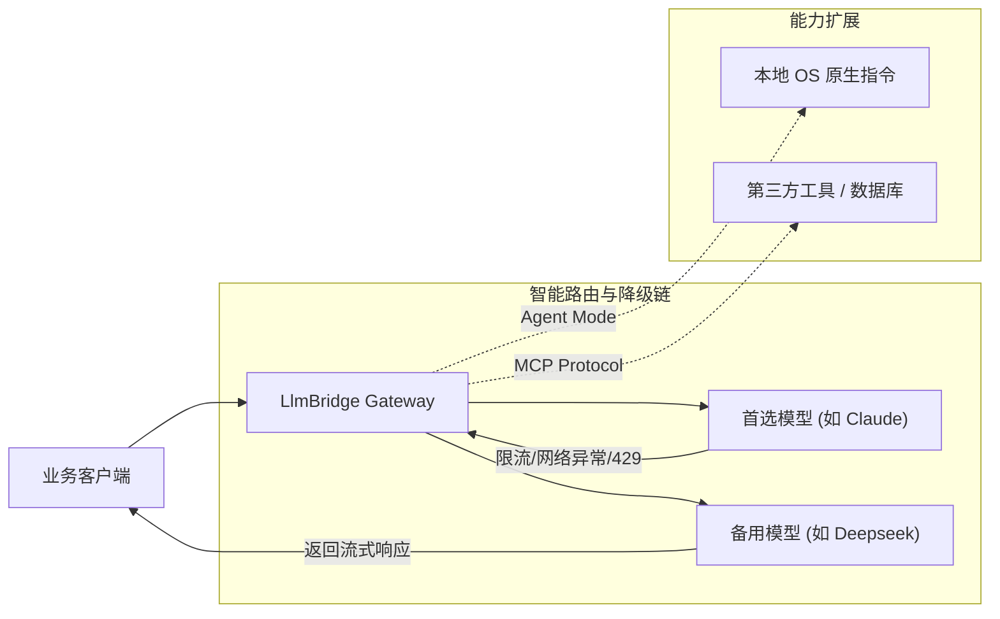
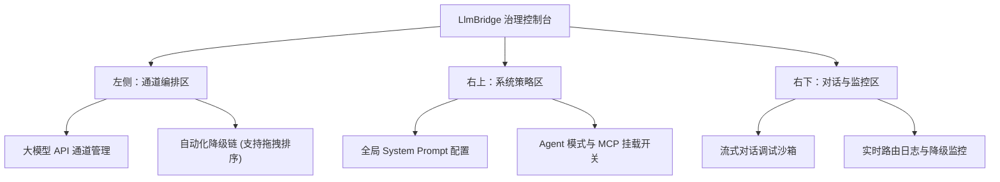
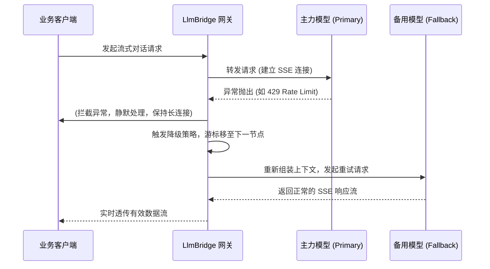

# LlmBridge Gateway

`LlmBridge` 是一款轻量级、零外部依赖的**大语言模型（LLM）流式代理与故障降级桥接网关**。它旨在为企业级应用和开发者提供一个高可用的大模型路由解决方案，支持多通道故障转移、Agent 操作系统级提权、MCP 工具扩展以及多模态媒体处理。

通过内置的可视化控制台，开发者可以实时编排路由规则、监控降级链路，并无缝集成外部能力，确保 AI 核心业务的绝对连续性与可扩展性。

## 架构概览 (Architecture Overview)

LlmBridge 在客户端与底层 LLM 供应商之间构建了一道智能路由防线，并在侧边链路上集成了 Agent 与 MCP 扩展能力：



## 核心特性 (Key Features)

*   **极速流式转发 (Streaming Proxy)**：基于原生 HTTP 流式处理，完美兼容标准 SSE (Server-Sent Events) 接口，实现零延迟的实时打字机输出效果。
*   **动态故障降级 (Fallback Chain)**：一旦首选模型发生异常（如欠费、限流、网络超时），网关将自动且静默地将上下文转移至备用通道，实现对前端透明的无缝切换。
*   **Agent 原生提权 (Agent Mode)**：开启后，赋予大语言模型对宿主操作系统的沙箱级操作权限（读写文件、管理目录、执行终端命令等），使模型从“对话框”走向“全栈执行器”。
*   **MCP 协议扩展 (Model Context Protocol)**：原生支持接入标准 MCP Server，支持动态挂载搜索引擎、关系型数据库、浏览器自动化等第三方扩展，无限拓展模型能力边界。
*   **多模态自适应压缩**：前端集成高级 Canvas 算法，对上传的超大分辨率（如视网膜屏截图）进行智能等比限高压缩（默认 2048px），大幅降低网络负载与 Token 消耗。
*   **持久化配置热更新**：支持在可视化面板中实时更新全局系统提示词 (System Prompt) 与通道配置，一键保存并持久化至 `config.json`，全程无需重启服务。

## 控制台构成 (Console Components)

为了提供直观的治理能力，LlmBridge 提供了一个极简的暗黑拟态风格视窗控制台：



## 降级路由机制 (Fallback Routing Mechanism)

LlmBridge 的核心是一个带有状态监控的强健事件流循环：



## 快速部署 (Quick Deployment)

### 1. 环境准备
项目无任何重量级框架依赖，只需基础的 Node.js 环境：

```bash
git clone https://github.com/your-username/llm-bridge-gateway.git
cd llm-bridge-gateway
npm install
```

### 2. 启动网关
*   **生产模式**：
    ```bash
    npm start
    ```
*   **开发调试模式（支持热重载）**：
    ```bash
    npm run dev
    ```

网关服务将默认监听：`http://localhost:3300`

### 3. 配置与集成
1. 访问 `http://localhost:3300` 进入可视化控制台。
2. 在 **LLM 通道列表** 添加基础 API 信息并编排降级链顺序。
3. 可选择在右上角开启 **Agent Mode** 以激活原生工具调用能力。
4. 将您的业务客户端请求地址指向 `http://localhost:3300/api/chat`，即可享受网关带来的高可用保障。

---

## 配置文件规范 (`config.json`)

系统所有的动态治理规则将自动下发并持久化至根目录下的 `config.json`：

```json
{
  "channels": [
    {
      "id": "Claude",
      "name": "Claude 3.5",
      "baseUrl": "https://api.your-provider.com/v1",
      "apiKey": "sk-your-api-key",
      "modelName": "claude-3-5-sonnet",
      "fastModelName": "claude-3-5-haiku"
    }
  ],
  "fallbackChain": [
    "Claude",
    "Deepseek"
  ],
  "agentMode": true,
  "systemPrompt": "You are a helpful assistant..."
}
```

## 技术栈 (Tech Stack)

*   **后端核心**：Node.js + Express 4.x (极简无冗余依赖)
*   **前端展现**：Vanilla HTML5 + Modern CSS3 (暗黑磨砂玻璃拟态) + Vanilla JS
*   **排版字体**：Inter / JetBrains Mono

## 开源协议 (License)

本项目基于 [MIT License](LICENSE) 协议开源。
